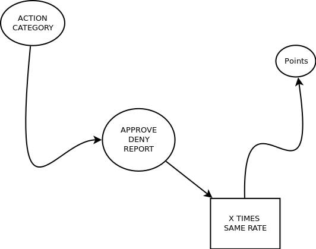
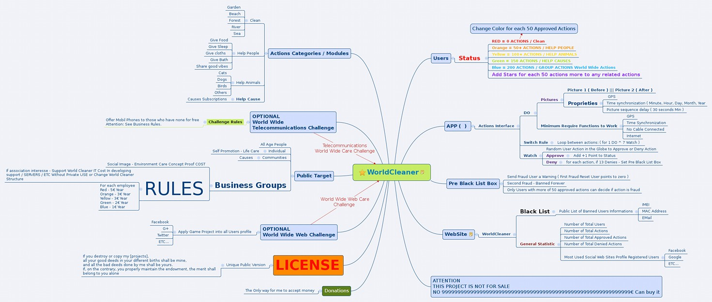

For **Educational** Proposes Only - Not only for Children

~ In a Monkey world everything would work like... ~

    ~ Monkey cannot impose his will of Power but can motivate Yours!!

### Intention:

    Learn by Educating Your self

Animated Example: [The Condition of Illusion](https://play.odicforcesounds.com)

"Each Positive Contribution that Benefit other Living Being may have Value. The Value
is in the capacity of any person to solve any problem that may be solved by Social Values which care,"

---

## Problems to solve:

Create better relations in society between all living Beings:

> Associate Economic Value to what have value as well? 


``` 
By the principles of Freedom of Choice, 
to associate economic value to the simplicity of life is not good, 
because they become acts of business and not acts of freedom. 
In the other hand, industry and economy and everyone work, 
happen by the same principle. People do work ( actions ) and the reward have economic value.
Question: Does the work have no value? 
Answer: Only if each don't like what they are doing, 
and even then, where are the values / principles that guide their choices? 
This problem that is in everyone life as the unique condition of having free will of choice
is the ( economic value ), which have no face, since 
( all coins do that work, if they are real coins or virtual )
Maybe we can only point the common healthier choices as an option that have no value at all, 
but only to show others that we did something for someone, in Time! :D 
```


- Rate every Positive Contribution from others.

**Note**: "In Social and Justice Perspective, to ask apologies in a way, where the "victim" feels that the "attacker"
is trully sorry, is rated as a positive **Deed**. By the same concept, all "bad" actions which take any social responsability as mistakes, can be "fixed", May everyone be OpenSource to their own Source and to everyone else.

1.  Students: Behaviors / Choices
2.  Social: Behaviors / Choices
3.  Professional: Behaviors / Choices

        ~ Don't rate / promote every Negative Contribution from others.

        ~ Discuss / Talk / Present solutions to fix those.

        ~ The Bad behaviors shall not become more important than the good.

        ~ Promote Good behaviors ( at all levels of society and associate value to it )

## Objectives:

- Motivate **World Wide Brands Industry** to pay more attention to their own Business to **care** Social and Nature Principles

1.  Count the number of times each personal characteristic is rated as positive.

        - Just for Fun: How many times I do good things to others?

        - Each employee need to do more than what he/she aims to do. Rate That!

        - Associate Value to each detail, to each singular action.

2.  Each positive point represent one coin.

        - If the difference is in the atittude, then atittudes have value.

        - More than the product it self.

> **TODO**: Build list of human / social characteristics that can be rated.

1. Each positive point shall have associated economic value.

- Points point to the value of one singularity ( good deed )

  - That is the value: It can be exchanged! ("in favor of")

## Rewards for Companies - Industry

1. External Image:

   Public Exposition as group who made X positive contributions to this system above / bellow others.

- Company Characteristics are based in Content and Actions:

  - **Content** is what a Company produce ( products )

  - What can become better ( Healthy Products ) ( social terms )

  - **Actions** is the social activity they promote with their own Time of Work.

  - What kind of Social Actions company promote ( social terms )

2. Internal Image:

- Internal Exposition as individuals who where rated for having positive contributions between colleagues ( commercial terms )

- What are the rate between clients and company employees ( commercial terms )

## Personal Characteristics:

> **TODO**: Social-Behaviors: Recommended-List

- NCP: Nature Care Path: Help plants, clean rivers, etc..

- ACP: Animal Care Path: Walk the dog, help animals, save cats / birds from bad situations but leave them free for the
  next one.

- HCP: Human Care Path: Give food, knowledge, cloths, etc.. Everything that is
  shared by Heart should have more value than the value of the object we share!
  Here we can ask a concept proof from "target", as a way to recognize this transaction.

> **TODO**: Professional-Behaviors: Recommended-List

- Care client: be cool, patient, etc..

## Includes Students and Schools

**Note**: People around the world say that "Time is Money", therefor for each positive result of each who spend Time to
learn and share that knowledge with the teacher, shall earn Money. The same interpretation, shall be added to each who was able to solve a problem. ( logic or
social )

> **TODO**: Student-Behaviors: Recommended-List

- Student-Objectives:
  1. For each Discipline, for each propriety of a discipline, if learned, gain value.
     - How many Books You read. What they are about? What did you learn, etc...
  2. From Students to colleagues, rate positive behaviors, report negative behaviors by **talking** with who produce them.
  3. From Students to Teachers, rate positive behaviors.
  4. From Teachers to Students, rate positive behaviors and proprieties of knowledge, students had demonstrated as gained.

---

"The Value is in the individual who gives a correct answer, not in the **Numeric Expression** which is the **object** we associate value.", while any blockchain can be related to that "numeric expression" as well!



---

## Developers

1. Rate each code contribution that fix your code problems
2. Rate each contribution others do in your work

## Writters

Writers are everywhere. Code Writters and Story Writters.

1. Fixing a mistake or mispell, diserves gratitude. (rate / share)

## Brands Challenge:

- Public or Private groups who represent a Logo

1. Clean Rivers
2. Change Products ( less poluents )
3. Build Green Zones
4. Share Waste
5. Recycle
6. Educate and Motivate other Brands doing the same

## Government Services

- Public or Private groups who represent a Logo ( ALL )

1. Rate behavior from Civilian to Professional
2. Professional rate Civilian Behavior.
3. Urgency Services:
   - For this particular problem we can add a video streaming solution as a Concept Proof.
   - Since it helps professionals to solve by making decisions to any problem they may need to care.
   - If Citizen Help by contributing with their Civic Action, they gain Social Points ( private or public ) each decide
     to their own.
   - To most of the Public Services Governments need access, most of the Times, the KEY members are
     non-public-services, but regular civilians. Be sure You Rate that Civic Action that have Value!!!  
     ( for 112 to police, etc... )
   - Joke?: If you don't find good poeple, become one. Then We All Can.

--- 



---

## Eternal License

You are Included in [this](https://art.odicforcesounds.com/pages/License/index.html) World Wide Target Eternal License!

There is a very basic example of Pseudocode of this challenge [here](./plan/psudoCode.md)

---

by OdicforceSounds - 2016-2035 - All Rights Reserved
